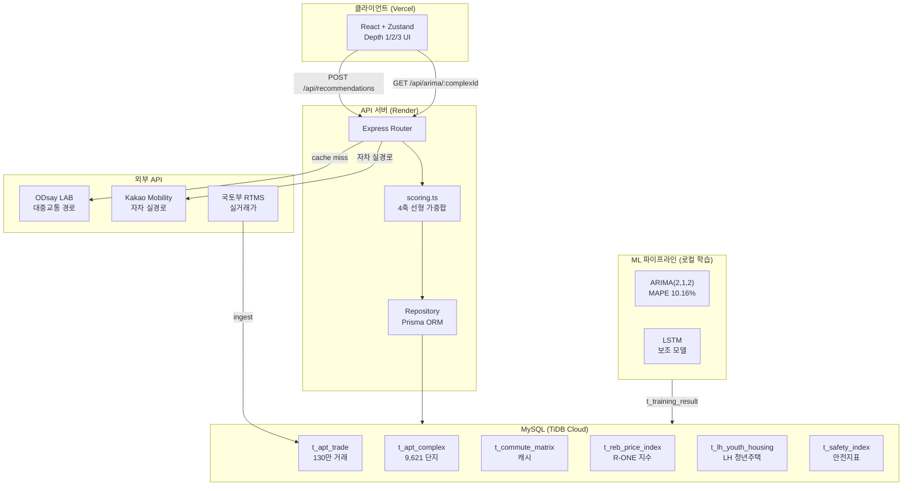

# 나어디삶 — 데이터 기반 청년 주거 의사결정 플랫폼

> **"어디서 살아야 할까?"** — 직장·예산·통근·안전을 한 번에 분석해 청년·신혼부부에게 최적 동네를 추천합니다.

[](https://www.typescriptlang.org/)
[](https://react.dev/)
[](https://expressjs.com/)
[](https://www.prisma.io/)

---

## 서비스 개요

기존 프롭테크는 raw 데이터를 쏟아내고 "판단은 알아서 하세요"라고 합니다.  
**나어디삶**은 반대입니다 — 6개 공공기관 데이터를 융합해 _정제된 신호_ 를 먼저 보여주고, 원하는 사람만 더 깊이 파고들 수 있게 합니다.

| 사용자 행동 | 화면 |
|---|---|
| 직장 입력 + 예산·가중치 설정 | **Depth 1** — 입력 헤더 |
| 서울 전체 히트맵으로 통근권 파악 | **Depth 2** — 지도 + 추천 카드 8선 |
| 단지 클릭 → ARIMA 가격 안정성 차트 | **Depth 3** — 상세 분석 |

---

## 아키텍처



---

## 추천 알고리즘 — 4축 가중합

```
totalScore = commuteScore × w₁
           + affordabilityScore × w₂   (RIR 역선형)
           + safetyScore × w₃          (경찰청 + CCTV + 가로등)
           + lifeScore × w₄            (TAGO 대중교통 품질)

w₁ + w₂ + w₃ + w₄ = 100  (사용자 직접 조정)
```

| 프리셋 | 통근 | 주거비 | 안전 | 생활 |
|---|---|---|---|---|
| 사회초년생 | 40 | 35 | 15 | 10 |
| 신혼부부 | 25 | 25 | 30 | 20 |
| 실거주 최적 | 20 | 30 | 30 | 20 |
| 직장인 | 50 | 20 | 15 | 15 |

---

## ARIMA 백테스트 결과

서울 5개 단지, **3년(36개월) horizon**, 실거래가 데이터 기준

| 단지 | 자치구 | ARIMA MAPE | LSTM MAPE | MA-12 MAPE |
|---|---|---|---|---|
| 파크리오 | 송파구 신천동 | 15.0% | 24.7% | 15.9% |
| SK북한산시티 | 강북구 미아동 | 16.0% | 16.8% | 12.0% |
| 중계그린1단지 | 노원구 중계동 | 8.9% | 20.5% | 6.0% |
| 선사현대 | 강동구 암사동 | 10.3% | 19.0% | 16.5% |
| 신동아1 | 도봉구 방학동 | 0.5% | 21.1% | 4.0% |
| **평균** | | **✅ 10.16%** | 20.41% | 10.88% |

> ARIMA(2,1,2) 가 multi-step 누적 오차 없이 LSTM 대비 절반 오차 달성  
> → Depth 3 메인 모델로 채택

---

## 융합 데이터 출처 (6개 기관)

| 기관 | 데이터 | 규모 |
|---|---|---|
| 국토교통부 | RTMS 아파트 실거래가 | ~130만 건 (2020~2025) |
| 한국부동산원 (R-ONE) | 공동주택 매매·전세 가격지수 | 1,116건 (서울 25구 월별) |
| 한국토지주택공사 (LH) | 행복주택·청년매입임대 공급 현황 | 3,950건 |
| 국가대중교통정보센터 (TAGO) | 버스정류장·배차간격 | 33개 행정동 |
| 경찰청·서울시 | 범죄율·CCTV·가로등 안전지표 | 469개 행정동 |
| 통계청 | 가구소득 분위 (2023) | 5분위 |

---

## 로컬 실행

```bash
# 1) 의존성 설치 (루트에서 workspaces 일괄)
npm install

# 2) 환경변수 설정
cp server/.env.example server/.env   # DATABASE_URL, ODSAY_API_KEY, KAKAO_REST_API_KEY 입력

# 3) MySQL 기동 (Docker)
docker compose up -d

# 4) DB 마이그레이션
npm --workspace server run prisma:migrate -- --name init

# 5) 개발 서버 실행 (client :5173 + server :4000 동시)
npm run dev
```

### API 동작 확인

```bash
# 헬스체크
curl http://localhost:4000/health

# 강남역 기준 추천 (가중치 합 = 100)
curl -X POST http://localhost:4000/api/recommendations \
  -H 'Content-Type: application/json' \
  -d '{"workplace":{"lat":37.4979,"lng":127.0276,"label":"강남역"},"budget":40000,"weights":{"commute":35,"affordability":30,"safety":20,"life":15},"patience":45}'
```

---

## 기술 스택

| 영역 | 기술 |
|---|---|
| 프론트엔드 | React 18, TypeScript, Vite, Zustand, Kakao Maps SDK |
| 백엔드 | Express 4, TypeScript, Prisma ORM |
| DB | MySQL 8 (로컬 Docker) / TiDB Cloud (운영) |
| ML | TensorFlow.js LSTM, Python statsmodels ARIMA, Node.js 백테스트 파이프라인 |
| 외부 API | ODsay LAB (대중교통), Kakao Mobility (자차 실경로), 국토부 RTMS, R-ONE, TAGO, LH |
| 배포 | Vercel (클라이언트), Render (서버) |

---

## 폴더 구조

```
2026_MOLIT_CONTEST/
├── client/                     # Vite + React SPA
│   └── src/
│       ├── pages/Recommendation/   # Depth 1/2/3 메인 UI
│       ├── stores/                 # Zustand 상태 (recommendation/auth/theme)
│       ├── api/                    # fetch 래퍼 + mock fallback
│       └── types/                  # 도메인 타입 정의
├── server/                     # Express API 서버
│   ├── prisma/schema.prisma        # DB 스키마 (SSOT)
│   └── src/
│       ├── routes/domains/         # 도메인별 라우터
│       ├── services/external/      # ODsay, Kakao, MOLIT, R-ONE 클라이언트
│       ├── services/repositories/  # Prisma 접근 레이어
│       └── services/ingest/        # 데이터 수집 배치
├── render.yaml                 # Render 배포 설정
└── docker-compose.yml          # 로컬 MySQL
```

---

## 관련 저장소

- **ML 파이프라인**: [2026_MOLIT_ML](../2026_MOLIT_ML) — LSTM 학습 + ARIMA 백테스트

---

## 라이선스

본 프로젝트는 2026 국토교통부 공공데이터 활용 공모전 출품작입니다.
