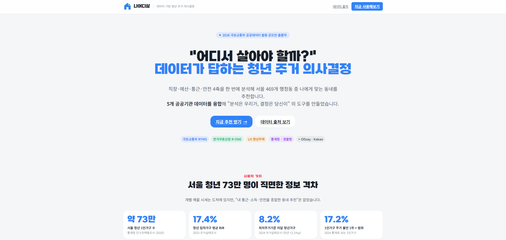
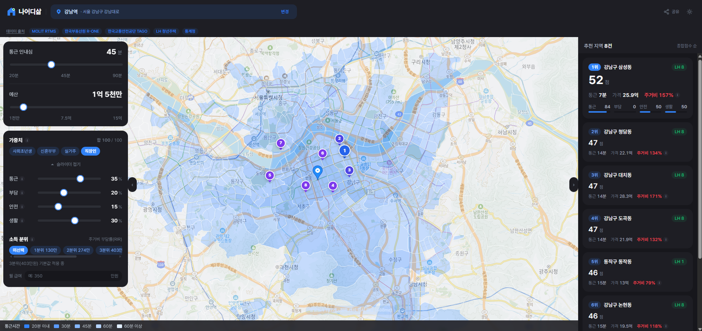
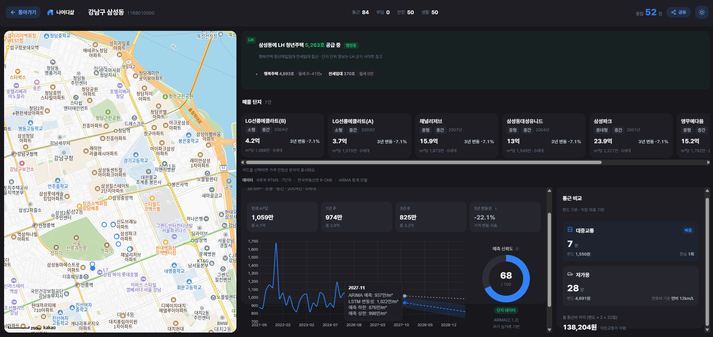
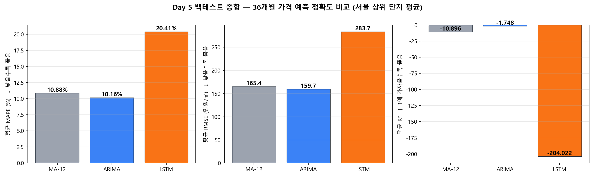
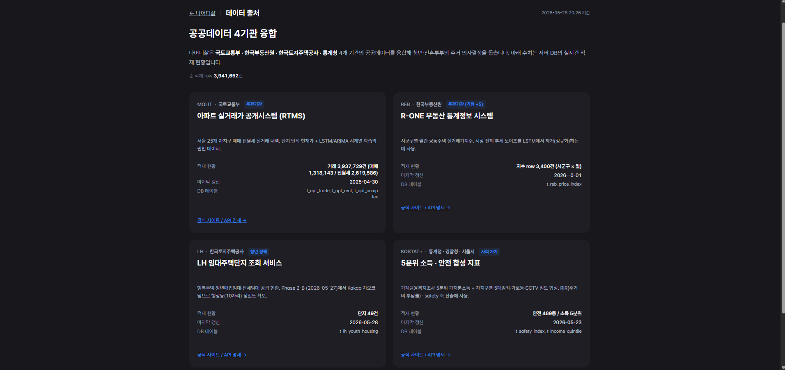
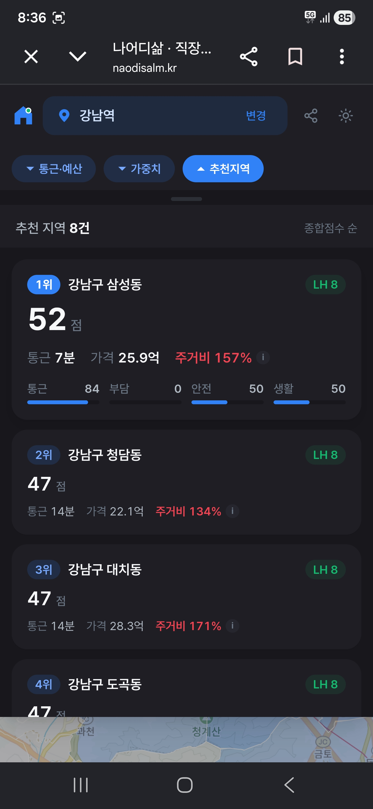
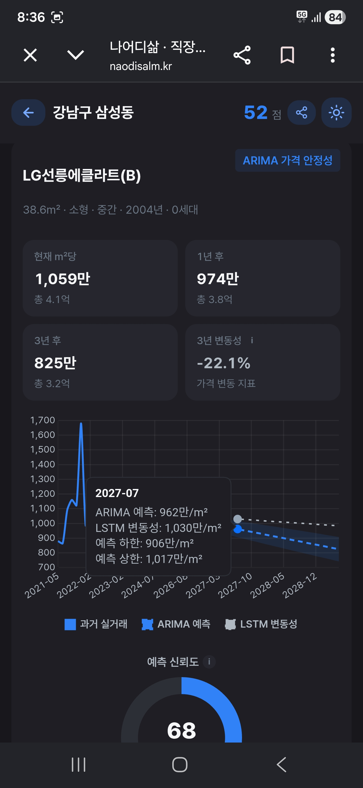
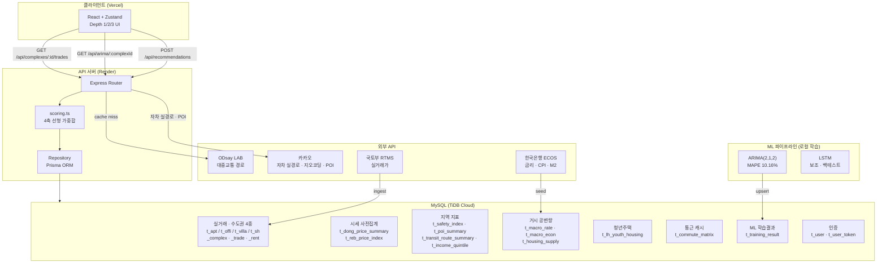

# 나어디삶 — 데이터 기반 청년 주거 의사결정 플랫폼

> **"어디서 살아야 할까?"** — 직장·예산·통근·안전을 한 번에 분석해 청년·신혼부부에게 최적 동네를 추천합니다.

[](https://www.typescriptlang.org/)
[](https://react.dev/)
[](https://expressjs.com/)
[](https://www.prisma.io/)

---

## 서비스 개요

기존 프롭테크는 raw 데이터를 쏟아내고 "판단은 알아서 하세요"라고 합니다.  
**나어디삶**은 반대입니다 — 6개 공공기관 데이터를 융합해 _정제된 신호_ 를 먼저 보여주고, 원하는 사람만 더 깊이 파고들 수 있게 합니다.

| 사용자 행동 | 화면 |
|---|---|
| 직장 입력 + 예산·가중치 설정 | **Depth 1** — 입력 헤더 |
| 수도권 전체 히트맵으로 통근권 파악 | **Depth 2** — 지도 + 추천 카드 8선 |
| 단지 클릭 → ARIMA 가격 안정성 차트 | **Depth 3** — 상세 분석 |

### 📸 화면

#### 1. 랜딩 (`/intro`) — 6기관 데이터 융합 + CTA



#### 2. 메인 추천 (`/`) — 강남역 입력 → 수도권 1,187개 행정동 중 8선



> 좌측: 통근·예산·가중치·소득분위 슬라이더 / 중앙: 통근 가능권 히트맵 + 추천 행정동 핀 / 우측: 8선 카드(통합점수·통근·가격·주거비율 RIR·LH 배지)

#### 3. Depth 3 — 단지 상세 + ARIMA 가격 안정성



> 단지별 ARIMA(2,1,2) 36개월 예측 + LSTM 변동성 보조 + 신뢰도 도넛(`dataScope: COMPLEX / LEGAL_DONG / SIGUNGU` 칩으로 정직 톤 표기) + 매물 8축 메트릭 + 통근/안전/생활 비교.

#### 4. ARIMA / LSTM / MA-12 백테스트 종합



> _자세한 수치는 아래 [ARIMA 백테스트 결과](#arima-백테스트-결과) 섹션 참조._

#### 5. 데이터 출처 (`/about/data`) — 6개 공공기관 + 민간 API 실시간 적재 현황



> 채점위원과 사용자 모두 `GET /api/meta/data-sources` 응답을 통해 row 수 실시간 확인 가능. (Phase 2-B 도입, 2026-05-27)

#### 6. 모바일 반응형 (Galaxy 영역)

<p align="left">
  
  
</p>

> 좌: 추천 8선 카드 리스트 + LH 청년주택 배지 / 우: Depth 3 단지 ARIMA 예측 차트 + 신뢰도 도넛.

### 🎬 데모 영상

> 30~60초 데모 GIF. 촬영 콘티: [`server/doc/2026-05-28/video-shoot-plan.md`](server/doc/2026-05-28/video-shoot-plan.md)
>
> _`docs/screenshots/demo.gif` — D-Day 촬영 후 첨부._
>
> <!--  -->

---

## 아키텍처


```mermaid
graph TD
    subgraph Client["클라이언트 (Vercel)"]
        UI["React + Zustand\nDepth 1/2/3 UI"]
    end

    subgraph Server["API 서버 (Render)"]
        API["Express Router"]
        SCORE["scoring.ts\n4축 선형 가중합"]
        REPO["Repository\nPrisma ORM"]
    end

    subgraph DB["MySQL (TiDB Cloud)"]
        RTMS["실거래 · 수도권 4종\nt_apt / t_offi / t_villa / t_sh\n_complex · _trade · _rent"]
        AGG["시세 사전집계\nt_dong_price_summary\nt_reb_price_index"]
        REGION["지역 지표\nt_safety_index · t_poi_summary\nt_transit_route_summary · t_income_quintile"]
        SUPPLY["거시 공변량\nt_macro_rate · t_macro_econ\nt_housing_supply"]
        LH["청년주택\nt_lh_youth_housing"]
        CACHE["통근 캐시\nt_commute_matrix"]
        TRAIN["ML 학습결과\nt_training_result"]
        AUTH["인증\nt_user · t_user_token"]
    end

    subgraph External["외부 API"]
        ODSAY["ODsay LAB\n대중교통 경로"]
        KAKAO["카카오\n자차 실경로 · 지오코딩 · POI"]
        MOLIT["국토부 RTMS\n실거래가"]
        ECOS["한국은행 ECOS\n금리 · CPI · M2"]
    end

    subgraph ML["ML 파이프라인 (로컬 학습)"]
        ARIMA["ARIMA(2,1,2)\nMAPE 10.16%"]
        LSTM["LSTM\n보조 · 백테스트"]
    end

    UI -->|POST /api/recommendations| API
    UI -->|GET /api/arima/:complexId| API
    UI -->|GET /api/complexes/:id/trades| API
    API --> SCORE --> REPO --> DB
    API -->|cache miss| ODSAY
    API -->|자차 실경로 · POI| KAKAO
    ARIMA -->|upsert| TRAIN
    MOLIT -->|ingest| RTMS
    ECOS -->|seed| SUPPLY
```

---

## 추천 알고리즘 — 4축 가중합

```
totalScore = commuteScore × w₁
           + affordabilityScore × w₂   (RIR 역선형)
           + safetyScore × w₃          (경찰청 + CCTV + 가로등)
           + lifeScore × w₄            (TAGO 대중교통 품질)

w₁ + w₂ + w₃ + w₄ = 100  (사용자 직접 조정)
```

| 프리셋 | 통근 | 주거비 | 안전 | 생활 |
|---|---|---|---|---|
| 사회초년생 | 40 | 35 | 15 | 10 |
| 신혼부부 | 25 | 25 | 30 | 20 |
| 실거주 최적 | 20 | 30 | 30 | 20 |
| 직장인 | 50 | 20 | 15 | 15 |

---

## ARIMA 백테스트 결과

서울 5개 단지, **3년(36개월) horizon**, 실거래가 데이터 기준


> _Day 5 백테스트 산출물 — 원본 PNG `NaODiSalm_ML/reports/plots/summary.png`, raw CSV `NaODiSalm_ML/reports/backtest_results.csv` (5단지 × 3모델 15행)._
> _R² 값은 3년 horizon multi-step 누적 평가 특성상 음수가 정상이며, 실용 지표는 MAPE/RMSE임. LSTM의 큰 오차는 단지 단위 시계열 표본 수 한계(단지당 examples 20~50개)가 그대로 노출된 결과로, 본 서비스는 **ARIMA(2,1,2)를 Depth 3 메인 모델로 채택하고 LSTM은 보조 모델**로 운영함._

| 단지 | 자치구 | ARIMA MAPE | LSTM MAPE | MA-12 MAPE |
|---|---|---|---|---|
| 파크리오 | 송파구 신천동 | 15.0% | 24.7% | 15.9% |
| SK북한산시티 | 강북구 미아동 | 16.0% | 16.8% | 12.0% |
| 중계그린1단지 | 노원구 중계동 | 8.9% | 20.5% | 6.0% |
| 선사현대 | 강동구 암사동 | 10.3% | 19.0% | 16.5% |
| 신동아1 | 도봉구 방학동 | 0.5% | 21.1% | 4.0% |
| **평균** | | **✅ 10.16%** | 20.41% | 10.88% |

> ARIMA(2,1,2) 가 multi-step 누적 오차 없이 LSTM 대비 절반 오차 달성  
> → Depth 3 메인 모델로 채택  
> _※ 단지별 forecast 곡선 10장(파크리오·SK북한산시티 등) 및 모델별 월 예측 raw CSV는 ML 레포 `reports/plots/` · `reports/predictions/` 에서 확인 가능._

---

## 융합 데이터 출처 (6개 공공기관 + 민간 API)

> 📊 **실시간 적재 현황**: 운영 중인 서비스의 [`/about/data`](https://naodisalm.kr/about/data) 페이지에서
> `GET /api/meta/data-sources` 응답으로 항상 최신 row 수 확인 가능. (Phase 2-B 도입, 2026-05-27)

_아래 6개 소스는 [`GET /api/meta/data-sources`](https://naodisalm.kr/about/data) 응답 구조와 1:1 정합합니다. **정확한 적재 row 수는 라이브 엔드포인트에서 항상 최신값으로 확인**하세요 (수도권 실거래는 수백만 건 규모)._

| 소스 (기관) | 데이터셋 | 산출 축 |
|---|---|---|
| 국토교통부 (MOLIT) | RTMS 실거래 — **수도권(서울·인천·경기)** 아파트·오피스텔·연립다세대·단독다가구 매매·전월세 | 동 시세 분포 · 단지 ARIMA 시계열 |
| 한국부동산원 (REB) | R-ONE 공동주택 실거래가지수 (시군구 × 월) | ARIMA(메인)·LSTM 예측 정규화 |
| 한국토지주택공사 (LH) | 행복주택·청년매입임대·전세임대 공급 (카카오 지오코딩 → 행정동 10자리) | Depth 2 "LH N" 배지·배너 |
| 통계청 · 경찰청 · 지자체 | 5분위 가처분소득 + 수도권 5대범죄·CCTV·가로등 안전 합성 | affordability(RIR) · safety |
| ODsay · 카카오 · TAGO · 국토부 | 통근 경로(대중교통·자차) + 대중교통 품질(정류소·배차, 지역별 provider 분기) | commute |
| 카카오 로컬 | 생활편의 POI 반경 500m (지하철·마트·편의점·카페·음식점·병원·약국·은행) | life |

> **+ 민간 API** — **ODsay LAB**(대중교통 경로·환승), **카카오**(자차 실경로·지오코딩·생활편의 POI). 결과는 캐시/요약 테이블(`t_commute_matrix`·`t_poi_summary`)로 적재해 재호출을 줄입니다.
>
> **+ ML 거시 공변량** (사용자 비노출, LSTM 다변량 입력용) — **한국은행 ECOS**(기준금리·주담대금리·CPI·M2·가계대출), **R-ONE/KOSIS**(시군구 미분양·입주물량)를 `t_macro_rate`·`t_macro_econ`·`t_housing_supply`로 적재. _누수 방지: 각 월 값은 그 달 실제 공표값만 저장._

### Phase 2-B 변경 (2026-05-27)

```
✅ LH 단지 주소 Kakao Local API 지오코딩 → 행정동 10자리 정밀도
✅ /api/regions/:legalDongCode/lh-summary 응답에 scope (DONG/SIGUNGU) 추가
✅ /api/meta/data-sources 신규 — 데이터 출처 실시간 적재량 노출
✅ /about/data 페이지 신규 — 공모전 채점위원 + 사용자 동시 확인
```

### 수도권 MVP & 이후 변경 (2026-05 → 06)

- **수도권 확장** — 서울 → **서울·인천·경기**. 실거래를 아파트 1종에서 **4종**(아파트·오피스텔·연립다세대·단독다가구) 매매·전월세로 보강해 청년 타깃 전월세 재고 확대. (유형별 분리 테이블 `t_{apt,offi,villa,sh}_*`)
- **추천 엔진 — 예산 재고(inventory) 게이트 (KI-24)** — 예산 필터를 단순 상한이 아닌 "감당 가능 매물 N건" 게이트로 재설계. 동×거래유형×매물조합 median + 보증금 히스토그램을 `t_dong_price_summary`에 **배치 사전집계** → 런타임 시세 조회 ~2.7s → **~10ms**.
- **통근 정밀도** — ODsay 일일 쿼터 게이트(env 임계값) + **내부 지하철 라우터를 하이브리드 폴백**으로 배선(인천 1·2호선 등 그래프 갭 보강). 통근 매트릭스는 좌표 3자리 cacheKey로 영구 캐시.
- **생활·안전 축** — 동 반경 500m 카카오 POI로 `life` 점수(`t_poi_summary`), 5대범죄·CCTV·가로등 합성 `safety`(`t_safety_index`), TAGO·국토부 정류소 품질(`t_transit_route_summary`).
- **ML 다변량 피처 (2026-06-06)** — 한국은행 ECOS 금리·CPI·M2·가계대출 + R-ONE/KOSIS 미분양·입주물량을 거시 공변량으로 적재(`t_macro_*`·`t_housing_supply`), APT 단지 좌표 백필. _LSTM direct multi-horizon 입력용 — 제품 런타임은 아직 비소비._
- **Depth 3 정직화 (2026-06-07)** — 가짜 LSTM 평면선 제거, 공포 유발 `-22%` → 정성 "가격 흐름", 신뢰도 평어 번역·저신뢰 추정톤. **실거래 원본 모달** 신설(`GET /api/complexes/:id/trades` — 면적·층·거래가 원본 노출, 판단은 사용자에게).
- **추천 ↔ 상세 정합** — 매매 추천 universe를 상세 표시 범위(APT-only, Phase 3까지)에 맞춰 `['APT']`로 정합 → 빌라 전용 동의 "추천됐는데 단지 없음" 해소.
- **운영·분석** — GA4(gtag) SPA 추적 단일화, `/about/data` 적재현황 콜드 내성(캐시+retry+stale 가드), prod 부하 테스트 리포트.

---

## 로컬 실행

```bash
# 1) 의존성 설치 (루트에서 workspaces 일괄)
npm install

# 2) 환경변수 설정
cp server/.env.example server/.env   # DATABASE_URL, ODSAY_API_KEY, KAKAO_REST_API_KEY 입력

# 3) MySQL 기동 (Docker)
docker compose up -d

# 4) DB 마이그레이션
npm --workspace server run prisma:migrate -- --name init

# 5) 개발 서버 실행 (client :5173 + server :4000 동시)
npm run dev
```

### API 동작 확인

```bash
# 헬스체크
curl http://localhost:4000/health

# 강남역 기준 추천 (가중치 합 = 100)
curl -X POST http://localhost:4000/api/recommendations \
  -H 'Content-Type: application/json' \
  -d '{"workplace":{"lat":37.4979,"lng":127.0276,"label":"강남역"},"budget":40000,"weights":{"commute":35,"affordability":30,"safety":20,"life":15},"patience":45}'
```

---

## 기술 스택

| 영역 | 기술 |
|---|---|
| 프론트엔드 | React 18, TypeScript, Vite, Zustand, Kakao Maps SDK |
| 백엔드 | Express 4, TypeScript, Prisma ORM |
| DB | MySQL 8 (로컬 Docker) / TiDB Cloud (운영) |
| ML | TensorFlow.js LSTM, Python statsmodels ARIMA, Node.js 백테스트 파이프라인 |
| 외부 API | ODsay LAB (대중교통), Kakao (자차 실경로·지오코딩·POI), 국토부 RTMS, R-ONE, TAGO, LH, 한국은행 ECOS (거시지표) |
| 배포 | Vercel (클라이언트), Render (서버) |

---

## 폴더 구조

```
NaODiSalm_Main/
├── client/                     # Vite + React SPA
│   └── src/
│       ├── pages/Recommendation/   # Depth 1/2/3 메인 UI
│       ├── stores/                 # Zustand 상태 (recommendation/auth/theme)
│       ├── api/                    # fetch 래퍼 + mock fallback
│       └── types/                  # 도메인 타입 정의
├── server/                     # Express API 서버
│   ├── prisma/schema.prisma        # DB 스키마 (SSOT)
│   └── src/
│       ├── routes/domains/         # 도메인별 라우터 (recommendations·regions·complexes·commute·meta)
│       ├── services/external/      # ODsay, Kakao, MOLIT, R-ONE, ECOS 클라이언트
│       ├── services/repositories/  # Prisma 접근 레이어
│       └── services/ingest/        # 데이터 수집 배치
├── render.yaml                 # Render 배포 설정
└── docker-compose.yml          # 로컬 MySQL
```

---

## 관련 저장소

- **ML 파이프라인**: [NaODiSalm_ML](https://github.com/eunseeeoking/NaODiSalm_ML) — LSTM 학습 + ARIMA 백테스트
  - `npm run train:stats` — 학습 결과 통계 (confidence NULL 분포 등)
  - `npm run train:backfill` — t_training_result.confidence NULL → MAPE 기반 자동 산출
  - `npm run backtest` — MA-12 / ARIMA / LSTM / LSTM-REB 4모델 비교 (PNG 산출)

---

## 운영 명령 (server)

```bash
cd server

# 데이터 적재 (모두 멱등)
npm run seed:reb              # 한국부동산원 R-ONE 매매·전세지수
npm run seed:lh -- --reset    # LH 청년주택 (Phase 2-B Kakao 지오코딩 통합)
npm run seed:safety           # 자치구 5대범죄 + CCTV + 가로등 합성
npm run seed:income           # 통계청 5분위 가처분소득
npm run seed:transit          # TAGO·국토부 정류소 대중교통 품질
npm run seed:life             # 카카오 POI 500m 생활편의 점수
npm run seed:price-summary    # 동×거래유형×매물조합 시세 사전집계 (KI-24 예산 게이트)

# ML 다변량 거시 피처 (ECOS_API_KEY / R-ONE·KOSIS 키 필요)
npm run seed:macro-rate       # 한국은행 기준금리·주담대금리
npm run seed:macro-econ       # CPI·M2·가계대출
npm run seed:housing-supply   # 시군구 미분양·입주물량
npm run geocode:complexes     # 단지 좌표 백필 (카카오 지오코딩)

# 진단 / 스냅샷 (read-only)
npm run db:snapshot           # 테이블별 row count → server/doc/db-state.md
npm run diagnose:depth3       # Depth 3 단지·LSTM 응답 회귀 점검
npm run diagnose:confidence   # t_training_result.confidence 분포

# 관리자 ingest (X-Admin-Token 필수)
curl -X POST http://localhost:4000/api/admin/ingest/apt/seoul \
  -H "X-Admin-Token: $ADMIN_TOKEN" \
  -H "Content-Type: application/json" \
  -d '{"fromYM":"202504","toYM":"202504"}'
```

---

## 라이선스

본 프로젝트는 2026 국토교통부 공공데이터 활용 공모전 출품작입니다.
