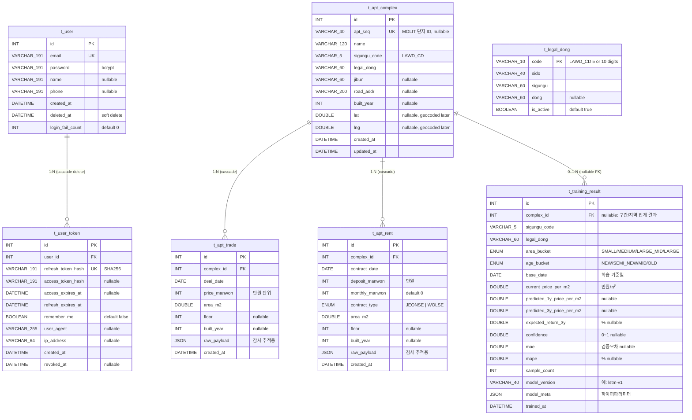

# DB ERD — 2026-05-18 시점 스냅샷

> 소스: `server/prisma/schema.prisma`
> 명명 규칙: 테이블 `t_{name}`, 컬럼 snake_case (Prisma model 의 `@@map` / `@map` 으로 매핑)

## 다이어그램



## 도메인별 그룹

| 그룹 | 테이블 | 책임 / 소유 |
|---|---|---|
| 사용자 / 인증 | `t_user`, `t_user_token` | server (CONTEST) |
| 행정구역 마스터 | `t_legal_dong` | server — 시드 1회 적재 (정적) |
| 부동산 ingest | `t_apt_complex`, `t_apt_trade`, `t_apt_rent` | server — 국토부 API 스케줄 적재 |
| ML 학습 결과 | `t_training_result` | ML 프로젝트 (`2026_MOLIT_ML`) — upsert |

## 관계 요약

```
t_user(1) ─── (N)t_user_token            [user_id, ON DELETE CASCADE]
t_apt_complex(1) ─── (N)t_apt_trade       [complex_id, ON DELETE CASCADE]
t_apt_complex(1) ─── (N)t_apt_rent        [complex_id, ON DELETE CASCADE]
t_apt_complex(0..1) ─── (N)t_training_result  [complex_id nullable, FK 없음 — 코드 매칭]

t_legal_dong  ─── (참조)  sigungu_code 코드 매칭으로 t_apt_complex / t_training_result
                          (FK 제약 없음 — 마스터 데이터)
```

## 유니크/인덱스 (재실행 안전성)

```
t_user                     UK(email)
t_user_token               UK(refresh_token_hash), IDX(user_id)
t_apt_complex              UK(apt_seq), UK(sigungu_code, legal_dong, name, built_year) — fingerprint
                           IDX(sigungu_code, legal_dong)
t_apt_trade                UK(complex_id, deal_date, area_m2, floor, price_manwon) — uniq_trade
                           IDX(complex_id, deal_date)
t_apt_rent                 UK(complex_id, contract_date, area_m2, floor, deposit_manwon, monthly_manwon)
                           IDX(complex_id, contract_date)
t_training_result          UK(sigungu_code, legal_dong, area_bucket, age_bucket, complex_id, base_date, model_version)
                           IDX(sigungu_code, legal_dong), IDX(complex_id), IDX(trained_at)
```

## 추가 예정 테이블 (계획)

```
t_commute_matrix  — 직장 ↔ 행정동 ODsay 통근시간 캐시 (Week 2)
                    cache_key (lat_lng 4자리 반올림), legal_dong_code, transit_minutes, ...
                    같은 직장 재입력 시 API 호출 0건 보장
```
